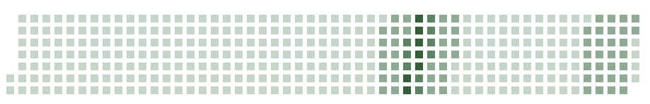

# weed365

GitHub weed style's Web Components.



Example is [here](https://sadnessojisan.github.io/weed365/).

The implementation is below.

```html
<!DOCTYPE html>
<html lang="en">
  <head>
    <meta charset="UTF-8" />
    <meta http-equiv="X-UA-Compatible" content="IE=edge" />
    <meta name="viewport" content="width=device-width, initial-scale=1.0" />
    <title>weed365 example page</title>
  </head>

  <body>
    <h1>Covid-19 in Tokyo</h1>
    <weed-365
      date="2021-05-14"
      kusas='{
        "2021-05-01": 595,
        "2021-05-02": 541,
        "2021-05-03": 592,
        "2021-05-04": 530,
        "2021-05-05": 604,
        "2021-05-06": 589,
        "2021-05-07": 598,
        "2021-05-08": 496,
        "2021-05-09": 431,
        "2021-05-10": 405,
        "2021-05-11": 363,
        "2021-05-12": 254,
        "2021-05-13": 101,
        "2021-05-14": 23,
      }'
    ></weed-365>
    <script src="https://cdn.jsdelivr.net/npm/weed365@0.0.3"></script>
  </body>
</html>
```

## How to use

Weed365 provides `<weed-365></weed-365>` tag.
`<weed-365></weed-365>` tag takes those props.

| name  | for what                                                                   |
| ----- | -------------------------------------------------------------------------- |
| date  | This is the end date of kusa layout.                                       |
| kusas | `{YYYY-MM-DD: value}`. For example `{'2021-01-01: 100, '2021-01-02': 200}` |

weed-365 paint color according to the kusa's value. If value is none, then kusa layout treat as 0.
